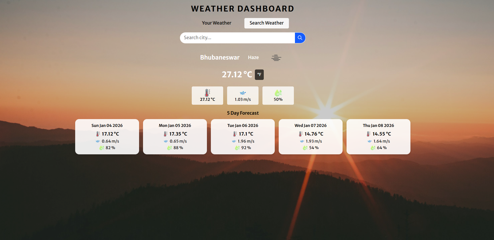

# 🌦️ Weather Forecast Dashboard

A responsive and interactive **Weather Forecast Web Application** that provides real-time weather information and a 5-day forecast.  
The application allows users to check weather details either by **current location** or by **searching a city name**.

Built using **HTML5**, **Tailwind CSS (CLI)**, and **Vanilla JavaScript**, with live data fetched from the **OpenWeatherMap API**.

---

## 🚀 Project Overview

The Weather Dashboard offers a clean UI and smooth user experience to display current weather conditions such as temperature, humidity, wind speed, and weather status.  
It also supports extended forecasting and dynamic UI changes based on weather conditions.

---

## ✨ Features

- 🔍 Search weather by city name  
- 📍 Get weather using **current location** (Geolocation API)  
- 🌡️ Displays:
  - Temperature
  - Weather description & icon
  - Humidity
  - Wind speed
- 📅 **5-Day Weather Forecast**
- 🔁 Temperature unit toggle (°C / °F)
- 🕒 Recently searched cities dropdown
- 🎨 Dynamic background based on weather conditions (sunny, rainy, cloudy, snow)
- ⚠️ Custom error handling for invalid cities & API errors
- 📱 Fully responsive for mobile, tablet, and desktop screens

---

## 🛠️ Tech Stack

- **HTML5** – Structure and layout  
- **Tailwind CSS (CLI)** – Styling and responsiveness  
- **JavaScript (ES6)** – Logic, API handling, and DOM manipulation  
- **OpenWeatherMap API** – Live weather data  

---

## 🌐 APIs Used

**OpenWeatherMap API**
- Current Weather API  
- 5-Day Weather Forecast API  

> Weather data is fetched using **latitude & longitude** for more accurate results.

---

## ▶️ How to Run the Project

1. Clone the repository:
   ```bash
   git clone <your-repository-url>

## screenshot of Weather Forecast Application


https://github.com/liku9/Weather_Forecast_Application